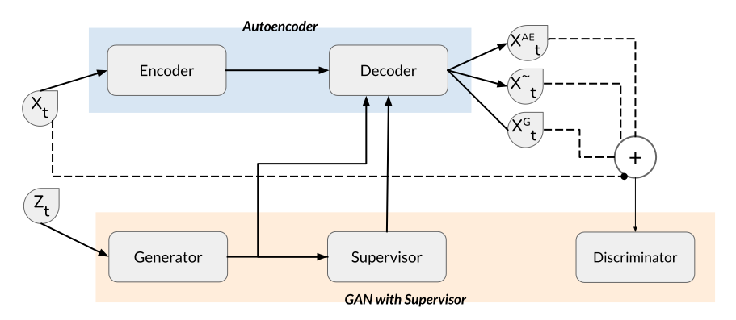

# DualGAN: Dual Adversarial Time Series Generation via Generative Adversarial Networks and Autoencoders

## Abstract
Generative Adversarial Network (GAN)-based methods for time series generation often face challenges, including slow convergence, information loss in embedding spaces, instability, and performance variability based on series length. To tackle these issues, we propose a comprehensive framework that merges the benefits of an Autoencoder-generated embedding space with the adversarial training dynamics of GANs. This framework benefits from a specialized time series loss function and oversight from a supervisory network, both of which capture the stepwise conditional distributions of the data effectively. The generator functions within the latent space, while the discriminator offers essential feedback based on the feature space. Moreover, we introduce an early stopping algorithm and an improved neural network architecture to enhance stability and ensure effective generalization across both short and long time series. Through joint training, our framework consistently surpasses existing benchmarks, producing high-fidelity time series data from a variety of real and synthetic datasets. Currently, the paper describing this framework is under submission.




## Installation
Clone the repository and install dependencies:
```bash
git clone https://github.com/samresume/DualGAN.git
cd DualGAN
pip install -r requirements.txt
```

## Usage
To get started, run the tutorial notebook:
```bash
jupyter notebook tutorial.ipynb
```

## Files
- `dualgan.py`: Main implementation of the DualGAN model.
- `data_loading.py`: Functions for loading and preprocessing data.
- `utils.py`: Helper utilities for the model.

