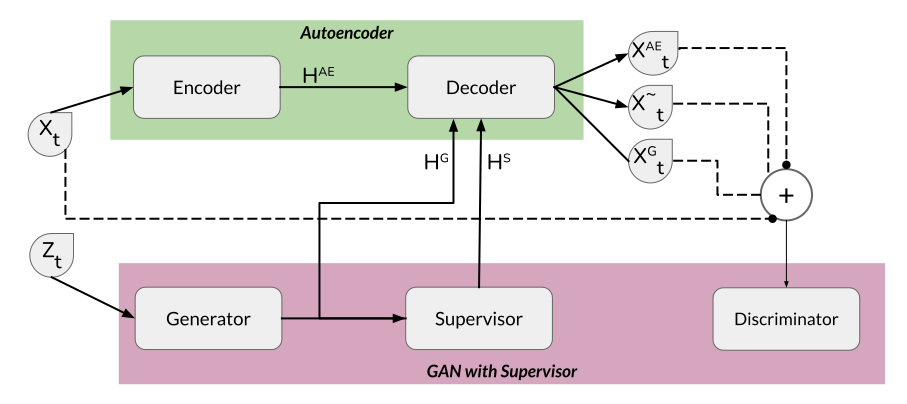

# ChronoGAN: Supervised and Embedded Generative Adversarial Networks for Time Series Generation

## Abstract
Generating time series data using Generative Adversarial Networks (GANs) presents several prevalent challenges, such as slow convergence, information loss in embedding spaces, instability, and performance variability depending on the series length. To tackle these obstacles, we introduce a robust framework aimed at addressing and mitigating these issues effectively. This advanced framework integrates the benefits of an Autoencoder-generated embedding space with the adversarial training dynamics of GANs. This framework benefits from a time series-based loss function and oversight from a supervisory network, both of which capture the stepwise conditional distributions of the data effectively. The generator functions within the latent space, while the discriminator offers essential feedback based on the feature space. Moreover, we introduce an early generation algorithm and an improved neural network architecture to enhance stability and ensure effective generalization across both short and long time series. Through joint training, our framework consistently outperforms existing benchmarks, generating high-quality time series data across a range of real and synthetic datasets with diverse characteristics.




## Installation
Clone the repository and install dependencies:
```bash
git clone https://github.com/samresume/ChronoGAN.git
cd ChronoGAN
pip install -r requirements.txt
```

## Usage
To get started, run the tutorial notebook:
```bash
jupyter notebook tutorial.ipynb
```

## Files
- `chronogan.py`: Main implementation of the ChronoGAN model.
- `data_loading.py`: Functions for loading and preprocessing data.
- `utils.py`: Helper utilities for the model.

